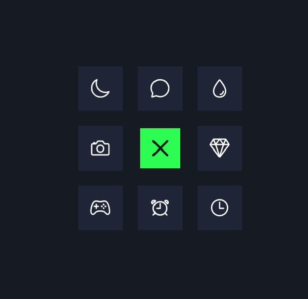
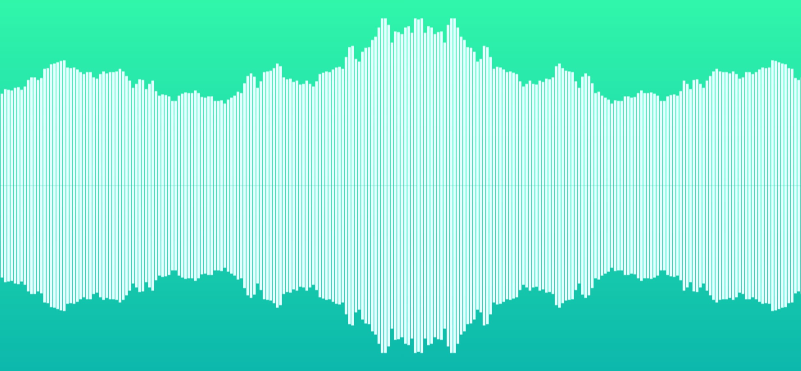

# Website-Collection

A collection of websites (mainly html+css) I built for practice.

 

## Cat-Photo-App

HTML form
[Link](https://wenbin1354.github.io/Website-Collection/cat-photo-app/cat-photo-app.html)

 

## Coffee-Shop

CSS
[Link](https://wenbin1354.github.io/Website-Collection/coffee-shop/coffee-shop.html)

 

## Marker

CSS
[Link](https://wenbin1354.github.io/Website-Collection/marker/marker.html)

 

## Registration-Form

HTML form
[Link](https://wenbin1354.github.io/Website-Collection/registration-form/registration-form.html)

 

## Navigation-Menu

Click on the 9 dot to expand and collapse the menu
[Link](https://wenbin1354.github.io/Website-Collection/navigation-menu/navigation-menu.html)

## Audio-Visualization

Plays the mp3 files in ./audio-visualization/MP3 folder and visualize it with canvas
[Link](https://wenbin1354.github.io/Website-Collection/audio-visualization/audio-visualization.html)