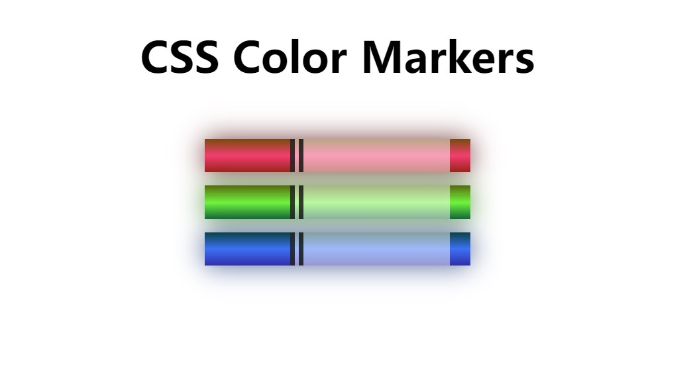

# Website-Collection

A collection of websites (mainly html+css) I built for practice.

 

## Cat-Photo-App

HTML form

[Link](https://wenbin1354.github.io/Website-Collection/cat-photo-app/cat-photo-app.html)

 

## Coffee-Shop

CSS

[Link](https://wenbin1354.github.io/Website-Collection/coffee-shop/coffee-shop.html)

 

## Marker

CSS

[Link](https://wenbin1354.github.io/Website-Collection/marker/marker.html)

 

## Registration-Form

HTML form

[Link](https://wenbin1354.github.io/Website-Collection/registration-form/registration-form.html)

 

## Navigation-Menus

CSS

[Link](https://wenbin1354.github.io/Website-Collection/navigation-menus/navigation-menu.html)

CSS

[Link](https://wenbin1354.github.io/Website-Collection/navigation-menus/navigation-menu1.html)

 

## Buttons

CSS

[Link](https://wenbin1354.github.io/Website-Collection/buttons/button.html)

CSS

[Link](https://wenbin1354.github.io/Website-Collection/buttons/button1.html)

 

## Audio-Visualization

Plays the mp3 files in ./audio-visualization/MP3 folder and visualize it with canvas, click on the page to start playing

[Link](https://wenbin1354.github.io/Website-Collection/audio-visualization/audio-visualization.html)

 

## Record-Screen

Enable screen share and it will record the screen.

[Link](https://wenbin1354.github.io/Website-Collection/record-screen/record-screen.html)

 

## Scrolling-Background

CSS

[Link](https://wenbin1354.github.io/Website-Collection/scrolling-background/scrolling-background.html)